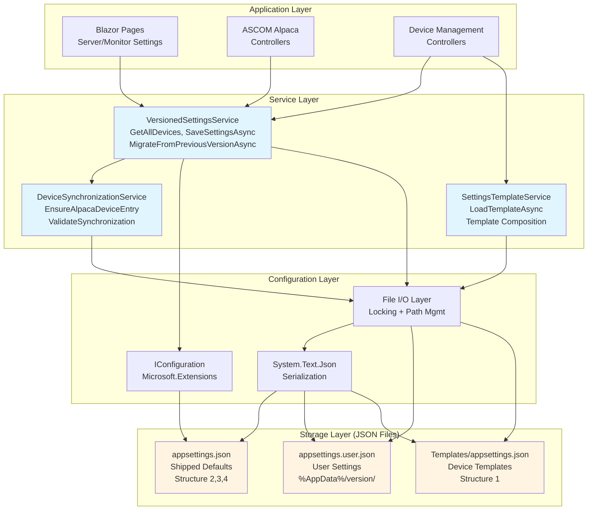
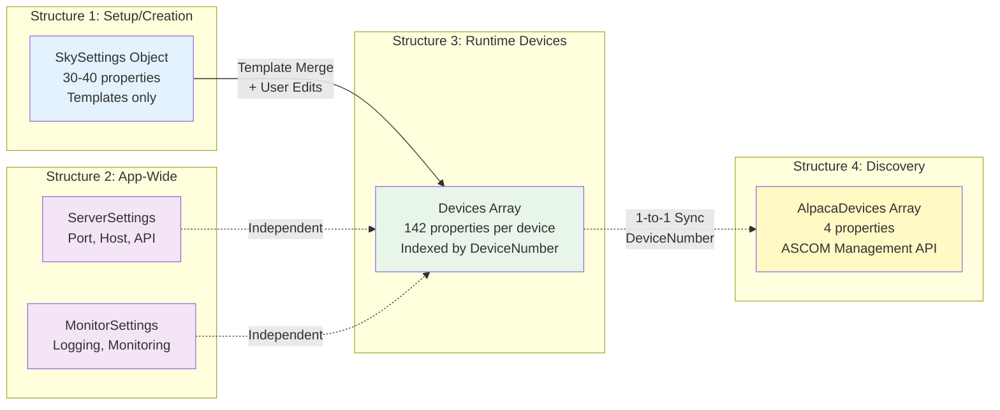
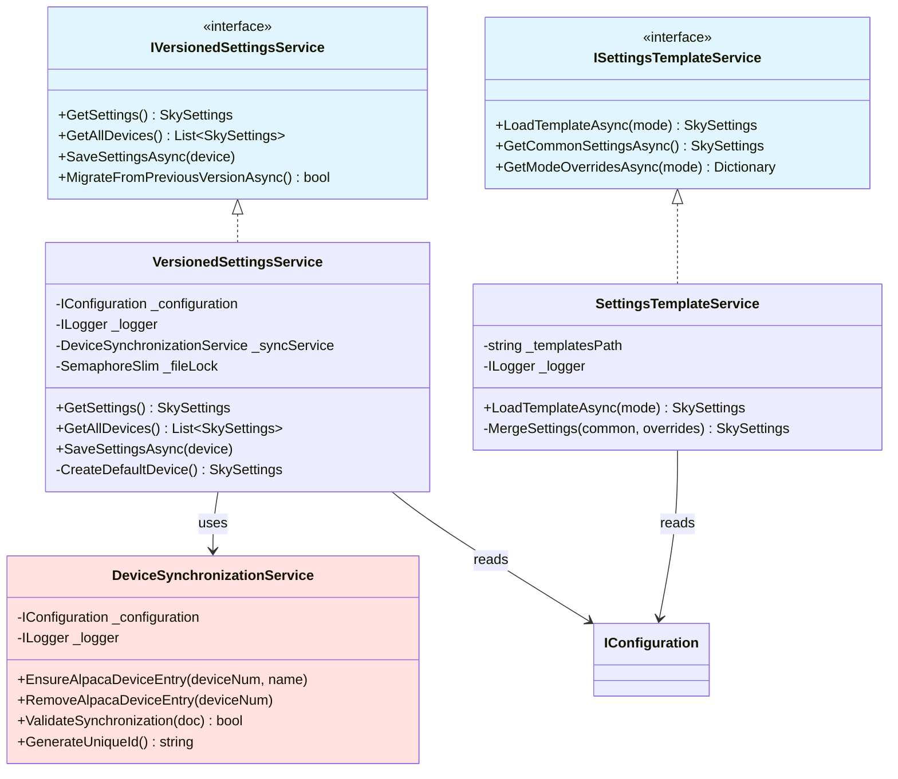
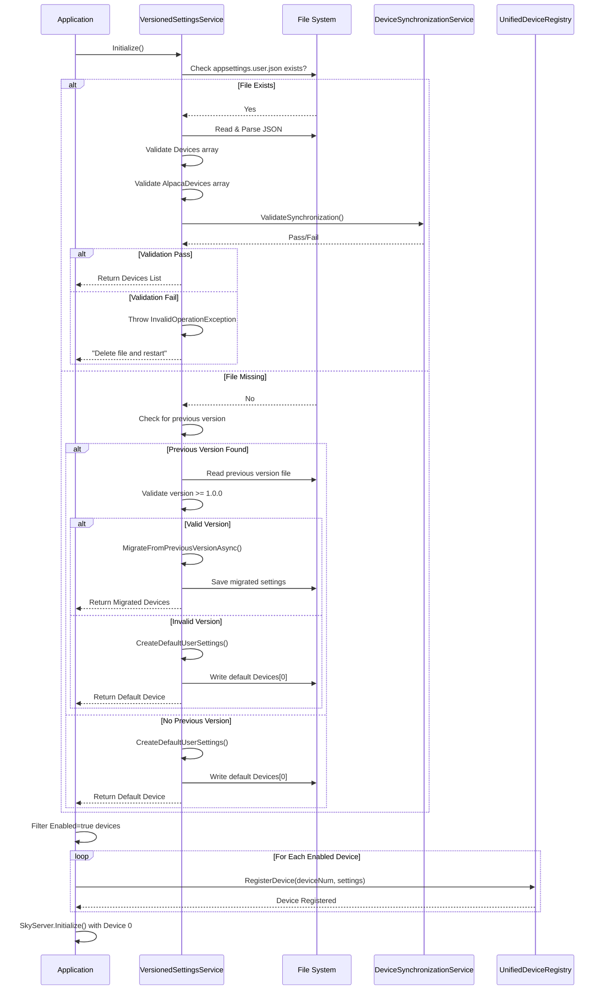
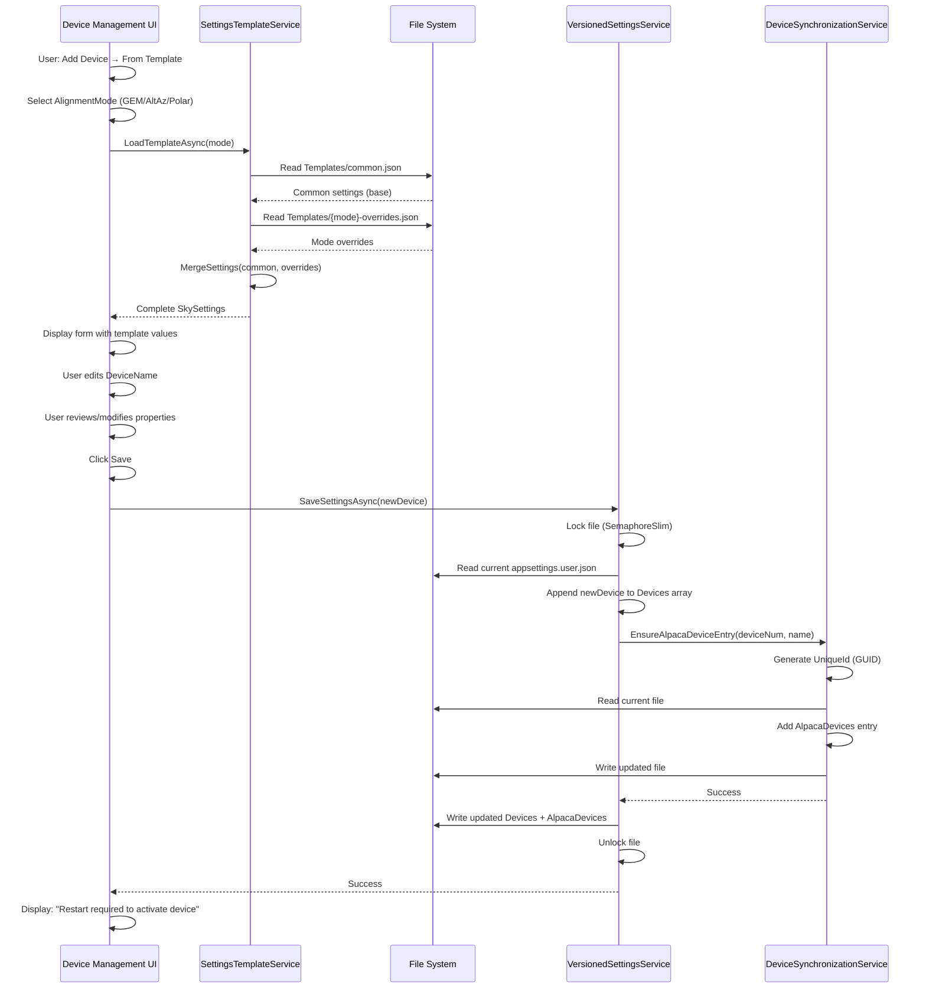
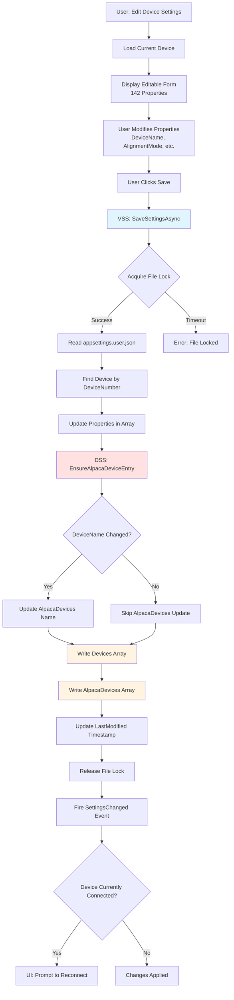
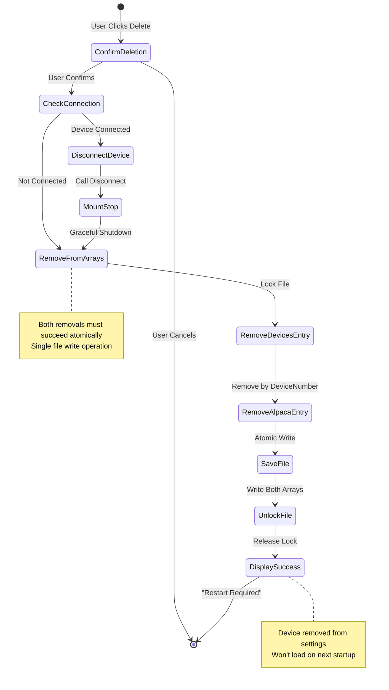
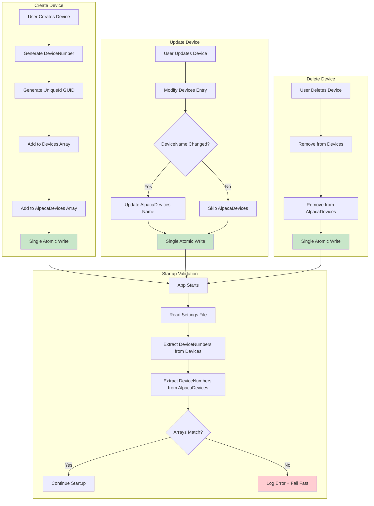

# Settings System High-Level Design

**Project:** GreenSwamp Alpaca - Multi-Device Telescope Control  
**Component:** Settings & Configuration Management  
**Version:** 1.0  
**Date:** 2025-01-XX  
**Status:** Design Review  
**Prerequisites:** [Settings-System-Requirements.md](./Settings-System-Requirements.md)

---

## 1. Executive Summary

This document describes the high-level architecture for the GreenSwamp Alpaca settings system supporting multiple ASCOM telescope devices with version-isolated, template-based configuration.

### Key Design Principles

1. **Separation of Concerns:** Four distinct JSON structures for different purposes
2. **Single Source of Truth:** Each configuration aspect has exactly one authoritative source
3. **Fail-Fast Validation:** Invalid configurations detected early with clear error messages
4. **Version Isolation:** Settings for different app versions stored separately
5. **No Magic:** All defaults configurable via JSON (no hardcoded values)

### Architecture Highlights

- **4 JSON Structures:** Setup/Creation, App-Wide Settings, Runtime Devices, Discovery Metadata
- **3 Configuration Files:** appsettings.json (defaults), appsettings.user.json (user), Templates/appsettings.json (templates)
- **2 Primary Services:** VersionedSettingsService (runtime), SettingsTemplateService (creation)
- **1-to-1 Synchronization:** AlpacaDevices ↔ Devices maintained atomically

### Critical Architecture Constraints

**1. Existing MonitorLog Pattern:**
All logging in the settings services MUST use the established `MonitorLog.LogToMonitor()` pattern from `GreenSwamp.Alpaca.Shared`. Do NOT use `ILogger<T>` from Microsoft.Extensions.Logging.

**Usage Pattern:**
```csharp
var monitorItem = new MonitorEntry
{
    Datetime = HiResDateTime.UtcNow,
    Device = MonitorDevice.Server,
    Category = MonitorCategory.Server,
    Type = MonitorType.Information, // or Warning, Error, Debug, Data
    Method = MethodBase.GetCurrentMethod()?.Name,
    Thread = Thread.CurrentThread.ManagedThreadId,
    Message = "Settings loaded successfully"
};
MonitorLog.LogToMonitor(monitorItem);
```

**2. Settings Populate Device Instances:**
Settings from JSON files are loaded at startup and used to populate device instances via `MountInstanceRegistry.CreateInstance()`:

**Flow:**
```
appsettings.user.json (Devices array)
    → VersionedSettingsService.GetAllDevices()
    → Returns List<SkySettings>
    → Program.cs: foreach enabled device
    → MountInstanceRegistry.CreateInstance(deviceNumber, settings, deviceName)
    → Creates SkyServer instance with settings
```

This ensures each device instance has its complete configuration available at runtime, enabling proper multi-device support with independent configurations per device.

---

## 2. System Architecture

### 2.1 Architecture Overview (Mermaid Diagram)



### 2.2 Four JSON Structures (Conceptual Model)



### 2.3 Service Dependencies



### 2.4 ASCII Architecture Diagram (Detailed)

```
┌─────────────────────────────────────────────────────────────────────────┐
│                         Application Layer                                │
│  ┌──────────────┐  ┌──────────────┐  ┌──────────────┐                  │
│  │ Blazor Pages │  │ ASCOM Alpaca │  │ Device Mgmt  │                  │
│  │ (Server/     │  │ Controllers  │  │ Controllers  │                  │
│  │  Monitor)    │  │              │  │              │                  │
│  └──────┬───────┘  └──────┬───────┘  └──────┬───────┘                  │
│         │                  │                  │                          │
└─────────┼──────────────────┼──────────────────┼──────────────────────────┘
          │                  │                  │
          ▼                  ▼                  ▼
┌─────────────────────────────────────────────────────────────────────────┐
│                         Service Layer                                    │
│  ┌────────────────────────────────────────────────────────────────┐    │
│  │              IVersionedSettingsService                          │    │
│  │  ┌──────────────────────────────────────────────────────────┐  │    │
│  │  │         VersionedSettingsService                          │  │    │
│  │  │  • GetSettings() → SkySettings                            │  │    │
│  │  │  • GetAllDevices() → List<SkySettings>                    │  │    │
│  │  │  • SaveSettingsAsync(device)                              │  │    │
│  │  │  • GetMonitorSettings() / SaveMonitorSettingsAsync()      │  │    │
│  │  │  • MigrateFromPreviousVersionAsync()                      │  │    │
│  │  │  • CreateDefaultDevice() [private]                        │  │    │
│  │  └──────────────────────────────────────────────────────────┘  │    │
│  └────────────────────────────────────────────────────────────────┘    │
│                                                                          │
│  ┌────────────────────────────────────────────────────────────────┐    │
│  │              ISettingsTemplateService                          │    │
│  │  ┌──────────────────────────────────────────────────────────┐  │    │
│  │  │         SettingsTemplateService                           │  │    │
│  │  │  • LoadTemplateAsync(mode) → SkySettings                  │  │    │
│  │  │  • GetCommonSettingsAsync() → SkySettings                 │  │    │
│  │  │  • GetModeOverridesAsync(mode) → Dictionary               │  │    │
│  │  └──────────────────────────────────────────────────────────┘  │    │
│  └────────────────────────────────────────────────────────────────┘    │
│                                                                          │
│  ┌────────────────────────────────────────────────────────────────┐    │
│  │              DeviceSynchronizationService [NEW]                │    │
│  │  • EnsureAlpacaDeviceEntry(deviceNumber, deviceName)          │    │
│  │  • RemoveAlpacaDeviceEntry(deviceNumber)                       │    │
│  │  • ValidateSynchronization() → bool                            │    │
│  │  • GenerateUniqueId() → Guid                                   │    │
│  └────────────────────────────────────────────────────────────────┘    │
└──────────────────────────────┬───────────────────────────────────────────┘
                               │
                               ▼
┌─────────────────────────────────────────────────────────────────────────┐
│                      Configuration Layer                                 │
│  ┌─────────────────┐  ┌──────────────────┐  ┌─────────────────────┐   │
│  │ IConfiguration  │  │  File I/O Layer  │  │  JSON Serializer    │   │
│  │ (Microsoft.     │  │  • File locking  │  │  System.Text.Json   │   │
│  │  Extensions)    │  │  • Path mgmt     │  │                     │   │
│  └────────┬────────┘  └────────┬─────────┘  └──────────┬──────────┘   │
│           │                    │                        │               │
└───────────┼────────────────────┼────────────────────────┼───────────────┘
            │                    │                        │
            ▼                    ▼                        ▼
┌─────────────────────────────────────────────────────────────────────────┐
│                      Storage Layer (JSON Files)                          │
│                                                                          │
│  ┌──────────────────────────────────────────────────────────────────┐  │
│  │  appsettings.json (Shipped with App)                             │  │
│  │  Location: GreenSwamp.Alpaca.Server/appsettings.json             │  │
│  │  ┌────────────────────────────────────────────────────────────┐  │  │
│  │  │ Structure 2: ServerSettings, MonitorSettings               │  │  │
│  │  │ Structure 3: Devices[0] with ALL 142 properties            │  │  │
│  │  │ Structure 4: AlpacaDevices[0] discovery metadata           │  │  │
│  │  └────────────────────────────────────────────────────────────┘  │  │
│  └──────────────────────────────────────────────────────────────────┘  │
│                                                                          │
│  ┌──────────────────────────────────────────────────────────────────┐  │
│  │  appsettings.user.json (User's Runtime Settings)                 │  │
│  │  Location: %AppData%/GreenSwampAlpaca/{version}/                 │  │
│  │  ┌────────────────────────────────────────────────────────────┐  │  │
│  │  │ Structure 2: ServerSettings, MonitorSettings (overrides)   │  │  │
│  │  │ Structure 3: Devices[0..N] user's devices                  │  │  │
│  │  │ Metadata: Version, CreatedDate, LastModified               │  │  │
│  │  └────────────────────────────────────────────────────────────┘  │  │
│  └──────────────────────────────────────────────────────────────────┘  │
│                                                                          │
│  ┌──────────────────────────────────────────────────────────────────┐  │
│  │  Templates/appsettings.json (Device Templates)                   │  │
│  │  Location: GreenSwamp.Alpaca.Settings/Templates/                 │  │
│  │  ┌────────────────────────────────────────────────────────────┐  │  │
│  │  │ Structure 1: SkySettings object (minimal properties)       │  │  │
│  │  │ Used by: SettingsTemplateService for device creation       │  │  │
│  │  └────────────────────────────────────────────────────────────┘  │  │
│  └──────────────────────────────────────────────────────────────────┘  │
└─────────────────────────────────────────────────────────────────────────┘
```

---

## 3. Four JSON Structures (Separation of Concerns)

### Structure 1: Setup/Creation Templates

**Purpose:** Device configuration templates for creating new devices  
**Format:** `SkySettings` object  
**Location:** `Templates/appsettings.json`  

```json
{
  "SkySettings": {
    "AlignmentMode": "GermanPolar",
    "Mount": "Simulator",
    "Port": "COM3",
    "BaudRate": 115200,
    // ...30-40 essential properties only...
  }
}
```

**Key Characteristics:**
- ✅ Minimal property set (30-40 properties)
- ✅ Used ONLY during device creation workflow
- ✅ Never contains DeviceNumber/DeviceName/Enabled (runtime properties)
- ✅ Embedded resource (ships with app, not user-editable)

---

### Structure 2: App-Wide Settings

**Purpose:** Application-level configuration independent of devices  
**Format:** Root-level sections  
**Location:** `appsettings.json` (defaults), `appsettings.user.json` (overrides)  

```json
{
  "ServerSettings": {
    // Configuration from "Server Settings" Blazor page
    // Properties TBD - requires UI review
  },
  "MonitorSettings": {
    "ServerDevice": true,
    "Telescope": true,
    "LogMonitor": false,
    "LogSession": true,
    "StartMonitor": false,
    "Language": "en-US"
  }
}
```

**Key Characteristics:**
- ✅ Device-independent settings
- ✅ Applies to entire application
- ✅ Edited via dedicated Blazor pages (Server Settings, Monitor Settings)
- ✅ Overrides: appsettings.user.json values override appsettings.json defaults

---

### Structure 3: Runtime Device Configurations

**Purpose:** Device-specific runtime settings indexed by device number  
**Format:** `Devices` array  
**Location:** `appsettings.json` (defaults), `appsettings.user.json` (user devices)  

```json
{
  "Devices": [
    {
      "DeviceNumber": 0,
      "DeviceName": "Simulator (GEM)",
      "Enabled": true,
      "Mount": "Simulator",
      "AlignmentMode": "GermanPolar",
      // ...ALL 142 SkySettings properties...
      "CanPark": true,
      "CanSlew": true,
      "ApertureDiameter": 0.2,
      "FocalLength": 1.26
    }
  ]
}
```

**Key Characteristics:**
- ✅ Complete property set (ALL 142 properties)
- ✅ Indexed by DeviceNumber (0-based)
- ✅ Source of truth for device runtime configuration
- ✅ Read by `GetAllDevices()` at application startup
- ✅ Written by `SaveSettingsAsync()` on changes

---

### Structure 4: Alpaca Device Discovery Metadata

**Purpose:** ASCOM Alpaca device discovery information for Management API  
**Format:** `AlpacaDevices` array indexed by device number  
**Location:** `appsettings.json`, `appsettings.user.json`  

```json
{
  "AlpacaDevices": [
    {
      "DeviceNumber": 0,
      "DeviceName": "Simulator (GEM)",
      "DeviceType": "Telescope",
      "UniqueId": "sim-gem-87654321-4321-4321-4321-cba987654321"
    }
  ]
}
```

**Key Characteristics:**
- ✅ Minimal metadata (4 properties only)
- ✅ MUST be 1-to-1 synchronized with Devices array
- ✅ Returned by `/management/v1/configureddevices` endpoint
- ✅ UniqueId is GUID generated at device creation (immutable)
- ❌ ProfileName removed (not required by ASCOM spec, misleading)

---

## 4. Service Layer Design

**⚠️ IMPORTANT - Logging Pattern:**
All service implementations in this section show `ILogger<T>` as placeholders. In actual implementation, **MUST use the existing MonitorLog pattern** instead:

```csharp
// ❌ DO NOT USE:
_logger.LogInformation("Settings loaded");
_logger.LogError(ex, "Failed to load settings");

// ✅ CORRECT PATTERN (after MonitorQueue is initialized):
var monitorItem = new MonitorEntry
{
    Datetime = HiResDateTime.UtcNow,
    Device = MonitorDevice.Server,
    Category = MonitorCategory.Server,
    Type = MonitorType.Information, // or Warning, Error, Debug
    Method = MethodBase.GetCurrentMethod()?.Name,
    Thread = Thread.CurrentThread.ManagedThreadId,
    Message = "Settings loaded successfully"
};
MonitorLog.LogToMonitor(monitorItem);
```

**⚠️ CRITICAL - Startup Timing Issue:**

**MonitorQueue Initialization Order:**
1. DI Container built → `builder.Services.AddVersionedSettings()` → **VersionedSettingsService constructed**
2. `app.Build()` completes
3. `MonitorQueue.EnsureInitialized()` called → **Queue starts running**
4. Settings services can NOW use `MonitorLog.LogToMonitor()`

**Problem:** VersionedSettingsService constructor runs BEFORE MonitorQueue is initialized!

**Solution - Use Fallback Logging Pattern:**

```csharp
/// <summary>
/// Safe logging that works during early initialization (before MonitorQueue starts)
/// </summary>
private void LogSafe(MonitorType type, string message, Exception? ex = null)
{
    try
    {
        // Try MonitorLog first (works if queue is running)
        var monitorItem = new MonitorEntry
        {
            Datetime = HiResDateTime.UtcNow,
            Device = MonitorDevice.Server,
            Category = MonitorCategory.Server,
            Type = type,
            Method = MethodBase.GetCurrentMethod()?.Name,
            Thread = Thread.CurrentThread.ManagedThreadId,
            Message = ex != null ? $"{message}|{ex.Message}" : message
        };
        MonitorLog.LogToMonitor(monitorItem);
    }
    catch
    {
        // Fallback to Console for very early startup (before MonitorQueue.EnsureInitialized)
        var prefix = type == MonitorType.Error ? "❌ ERROR" : 
                     type == MonitorType.Warning ? "⚠️ WARNING" : "ℹ️ INFO";
        Console.WriteLine($"{prefix} [VersionedSettingsService]: {message}");
        if (ex != null)
            Console.WriteLine($"  Exception: {ex.Message}");
    }
}

// Usage in constructor or early methods:
public VersionedSettingsService(IConfiguration configuration)
{
    _configuration = configuration;
    _versionDirectory = GetVersionDirectory();

    LogSafe(MonitorType.Information, "VersionedSettingsService initialized");
    LogSafe(MonitorType.Information, $"Version directory: {_versionDirectory}");
}
```

**Required Using Statements:**
```csharp
using GreenSwamp.Alpaca.Shared;
using System.Reflection;
using System.Threading;
```

**Remove from constructors:** `ILogger<T>` parameters
**Remove from fields:** `private readonly ILogger<T> _logger;`
**Add helper method:** `LogSafe()` for startup-safe logging


---

### 4.1 VersionedSettingsService

**Responsibilities:**
- Load/save user settings from version-isolated directory
- Provide default device configuration when no user settings exist
- Manage device CRUD operations
- Handle version migration
- Enforce 1-to-1 AlpacaDevices/Devices synchronization

**Key Methods:**

```csharp
public class VersionedSettingsService : IVersionedSettingsService
{
    private readonly IConfiguration _configuration;
    private readonly ILogger<VersionedSettingsService> _logger;
    private readonly DeviceSynchronizationService _syncService;
    private readonly SemaphoreSlim _fileLock = new(1, 1);
    private readonly string _versionDirectory;
    
    // === Read Operations ===
    
    /// <summary>
    /// Gets first device (backward compatibility with single-device code)
    /// </summary>
    public SkySettings GetSettings()
    {
        var devices = GetAllDevices();
        return devices.FirstOrDefault() ?? CreateDefaultDevice();
    }
    
    /// <summary>
    /// Gets all devices from Devices array
    /// Throws InvalidOperationException if file corrupt (fail-fast)
    /// </summary>
    public List<SkySettings> GetAllDevices()
    {
        // If no user file exists, create with defaults
        if (!File.Exists(userSettingsPath))
        {
            CreateDefaultUserSettings();
            return new List<SkySettings> { CreateDefaultDevice() };
        }
        
        // Read and deserialize
        var json = File.ReadAllText(userSettingsPath);
        var doc = JsonSerializer.Deserialize<Dictionary<string, JsonElement>>(json);
        
        // STRICT VALIDATION - fail fast with clear error
        if (doc == null || !doc.ContainsKey("Devices"))
        {
            throw new InvalidOperationException(
                $"Settings file missing 'Devices' array. " +
                $"Delete {userSettingsPath} and restart.");
        }
        
        var devices = doc["Devices"].Deserialize<List<SkySettings>>();
        if (devices == null || !devices.Any())
        {
            throw new InvalidOperationException(
                $"Settings file has empty 'Devices' array. " +
                $"Delete {userSettingsPath} and restart.");
        }
        
        // Validate synchronization with AlpacaDevices
        _syncService.ValidateSynchronization(doc);
        
        return devices;
    }
    
    /// <summary>
    /// Creates default device from appsettings.json Devices[0]
    /// All 142 properties populated from JSON (no hardcoded defaults)
    /// </summary>
    private SkySettings CreateDefaultDevice()
    {
        var settings = new SkySettings();
        
        // Bind ALL properties from Devices:0 in appsettings.json
        _configuration.GetSection("Devices:0").Bind(settings);
        
        // Ensure Phase 3 properties are set
        settings.DeviceNumber = 0;
        if (string.IsNullOrEmpty(settings.DeviceName))
            settings.DeviceName = "Telescope";
        settings.Enabled = true;
        
        return settings;
    }
    
    // === Write Operations ===
    
    /// <summary>
    /// Saves single device settings (updates device in array)
    /// Maintains AlpacaDevices synchronization
    /// </summary>
    public async Task SaveSettingsAsync(SkySettings settings)
    {
        await _fileLock.WaitAsync();
        try
        {
            var allDevices = GetAllDevices();
            
            // Find and update device by DeviceNumber
            var index = allDevices.FindIndex(d => d.DeviceNumber == settings.DeviceNumber);
            if (index >= 0)
            {
                allDevices[index] = settings;
            }
            else
            {
                // New device - add to list
                allDevices.Add(settings);
            }
            
            // Save updated list
            await SaveAllDevicesAsync(allDevices);
            
            // Ensure AlpacaDevices entry exists/updated
            await _syncService.EnsureAlpacaDeviceEntry(
                settings.DeviceNumber, 
                settings.DeviceName);
            
            // Update timestamps
            UpdateLastModified();
            
            SettingsChanged?.Invoke(this, settings);
        }
        finally
        {
            _fileLock.Release();
        }
    }
    
    /// <summary>
    /// Saves all devices atomically
    /// Used by migration and bulk operations
    /// </summary>
    private async Task SaveAllDevicesAsync(List<SkySettings> devices)
    {
        var userSettings = new Dictionary<string, JsonElement>
        {
            ["Devices"] = JsonSerializer.SerializeToElement(devices),
            ["Version"] = JsonSerializer.SerializeToElement(CurrentVersion),
            ["LastModified"] = JsonSerializer.SerializeToElement(DateTime.UtcNow)
        };
        
        var options = new JsonSerializerOptions { WriteIndented = true };
        var json = JsonSerializer.Serialize(userSettings, options);
        await File.WriteAllTextAsync(userSettingsPath, json);
    }
    
    // === Migration ===
    
    /// <summary>
    /// Migrates settings from previous version
    /// Only supports v1.0.0+ (baseline version)
    /// </summary>
    public async Task<bool> MigrateFromPreviousVersionAsync()
    {
        var versions = GetAvailableVersions()
            .Where(v => v != CurrentVersion)
            .OrderByDescending(v => new Version(v))
            .ToList();
        
        if (!versions.Any()) return false;
        
        var previousVersion = versions.First();
        
        // Enforce v1.0.0 baseline
        if (new Version(previousVersion) < new Version(1, 0, 0))
        {
            _logger.LogError(
                "Cannot migrate from pre-1.0.0. Delete {Path} and restart.",
                GetUserSettingsPath(previousVersion));
            return false;
        }
        
        // Read previous settings
        var previousJson = await File.ReadAllTextAsync(GetUserSettingsPath(previousVersion));
        var previousDoc = JsonSerializer.Deserialize<Dictionary<string, JsonElement>>(previousJson);
        
        // Validate Devices array exists
        if (!previousDoc.ContainsKey("Devices"))
        {
            _logger.LogError("Previous version missing Devices array");
            return false;
        }
        
        var devices = previousDoc["Devices"].Deserialize<List<SkySettings>>();
        
        // Apply version-specific migrations
        var migratedDevices = devices
            .Select(d => ApplyMigrations(d, previousVersion, CurrentVersion))
            .ToList();
        
        await SaveAllDevicesAsync(migratedDevices);
        return true;
    }
}
```

---

### 4.2 SettingsTemplateService

**Responsibilities:**
- Load device templates for creation workflow
- Merge common settings with mode-specific overrides
- Provide template composition logic

**Key Methods:**

```csharp
public class SettingsTemplateService : ISettingsTemplateService
{
    private readonly string _templatesPath;
    
    /// <summary>
    /// Loads complete settings for alignment mode
    /// Merges common.json + {mode}-overrides.json
    /// </summary>
    public async Task<SkySettings> LoadTemplateAsync(AlignmentMode mode)
    {
        // Load common settings (base template)
        var common = await GetCommonSettingsAsync();
        
        // Load mode-specific overrides
        var overrides = await GetModeOverridesAsync(mode);
        
        // Merge: overrides take precedence
        var merged = MergeSettings(common, overrides);
        
        return merged;
    }
    
    /// <summary>
    /// Loads common settings from Templates/common.json
    /// </summary>
    public async Task<SkySettings> GetCommonSettingsAsync()
    {
        var path = Path.Combine(_templatesPath, "common.json");
        var json = await File.ReadAllTextAsync(path);
        
        // Deserialize SkySettings object
        var doc = JsonSerializer.Deserialize<Dictionary<string, JsonElement>>(json);
        return doc["SkySettings"].Deserialize<SkySettings>();
    }
    
    /// <summary>
    /// Loads mode overrides from Templates/{mode}-overrides.json
    /// </summary>
    public async Task<Dictionary<string, object>> GetModeOverridesAsync(AlignmentMode mode)
    {
        var fileName = $"{mode.ToString().ToLowerInvariant()}-overrides.json";
        var path = Path.Combine(_templatesPath, fileName);
        
        if (!File.Exists(path))
            return new Dictionary<string, object>();
        
        var json = await File.ReadAllTextAsync(path);
        return JsonSerializer.Deserialize<Dictionary<string, object>>(json);
    }
    
    /// <summary>
    /// Merges common settings with mode overrides
    /// Overrides take precedence using reflection
    /// </summary>
    private SkySettings MergeSettings(
        SkySettings common, 
        Dictionary<string, object> overrides)
    {
        var merged = new SkySettings();
        
        // Copy all properties from common
        foreach (var prop in typeof(SkySettings).GetProperties())
        {
            var value = prop.GetValue(common);
            prop.SetValue(merged, value);
        }
        
        // Apply overrides
        foreach (var kvp in overrides)
        {
            var prop = typeof(SkySettings).GetProperty(kvp.Key);
            if (prop != null && prop.CanWrite)
            {
                var convertedValue = Convert.ChangeType(kvp.Value, prop.PropertyType);
                prop.SetValue(merged, convertedValue);
            }
        }
        
        return merged;
    }
}
```

---

### 4.3 DeviceSynchronizationService (NEW)

**Responsibilities:**
- Maintain 1-to-1 synchronization between AlpacaDevices and Devices arrays
- Generate UniqueId for new devices
- Validate synchronization on startup

```csharp
public class DeviceSynchronizationService
{
    private readonly IConfiguration _configuration;
    
    /// <summary>
    /// Ensures AlpacaDevices entry exists for device
    /// Creates if missing, updates DeviceName if changed
    /// </summary>
    public async Task EnsureAlpacaDeviceEntry(int deviceNumber, string deviceName)
    {
        var userSettingsPath = GetUserSettingsPath();
        var json = await File.ReadAllTextAsync(userSettingsPath);
        var doc = JsonSerializer.Deserialize<Dictionary<string, JsonElement>>(json);
        
        // Get or create AlpacaDevices array
        var alpacaDevices = doc.ContainsKey("AlpacaDevices")
            ? doc["AlpacaDevices"].Deserialize<List<AlpacaDevice>>()
            : new List<AlpacaDevice>();
        
        // Find existing entry
        var entry = alpacaDevices.FirstOrDefault(d => d.DeviceNumber == deviceNumber);
        
        if (entry == null)
        {
            // Create new entry
            entry = new AlpacaDevice
            {
                DeviceNumber = deviceNumber,
                DeviceName = deviceName,
                DeviceType = "Telescope",
                UniqueId = GenerateUniqueId()
            };
            alpacaDevices.Add(entry);
            
            _logger.LogInformation(
                "Created AlpacaDevice entry for device {DeviceNumber}", 
                deviceNumber);
        }
        else if (entry.DeviceName != deviceName)
        {
            // Update name if changed
            entry.DeviceName = deviceName;
            
            _logger.LogInformation(
                "Updated AlpacaDevice name for device {DeviceNumber}: {Name}",
                deviceNumber, deviceName);
        }
        
        // Save updated AlpacaDevices array
        doc["AlpacaDevices"] = JsonSerializer.SerializeToElement(alpacaDevices);
        
        var options = new JsonSerializerOptions { WriteIndented = true };
        json = JsonSerializer.Serialize(doc, options);
        await File.WriteAllTextAsync(userSettingsPath, json);
    }
    
    /// <summary>
    /// Removes AlpacaDevice entry when device deleted
    /// </summary>
    public async Task RemoveAlpacaDeviceEntry(int deviceNumber)
    {
        var userSettingsPath = GetUserSettingsPath();
        var json = await File.ReadAllTextAsync(userSettingsPath);
        var doc = JsonSerializer.Deserialize<Dictionary<string, JsonElement>>(json);
        
        if (!doc.ContainsKey("AlpacaDevices")) return;
        
        var alpacaDevices = doc["AlpacaDevices"].Deserialize<List<AlpacaDevice>>();
        var removed = alpacaDevices.RemoveAll(d => d.DeviceNumber == deviceNumber);
        
        if (removed > 0)
        {
            doc["AlpacaDevices"] = JsonSerializer.SerializeToElement(alpacaDevices);
            
            var options = new JsonSerializerOptions { WriteIndented = true };
            json = JsonSerializer.Serialize(doc, options);
            await File.WriteAllTextAsync(userSettingsPath, json);
            
            _logger.LogInformation(
                "Removed AlpacaDevice entry for device {DeviceNumber}",
                deviceNumber);
        }
    }
    
    /// <summary>
    /// Validates 1-to-1 synchronization on startup
    /// Fails fast if arrays out of sync
    /// </summary>
    public bool ValidateSynchronization(Dictionary<string, JsonElement> doc)
    {
        if (!doc.ContainsKey("Devices") || !doc.ContainsKey("AlpacaDevices"))
        {
            _logger.LogWarning("Missing Devices or AlpacaDevices array");
            return false;
        }
        
        var devices = doc["Devices"].Deserialize<List<SkySettings>>();
        var alpacaDevices = doc["AlpacaDevices"].Deserialize<List<AlpacaDevice>>();
        
        var deviceNumbers = devices.Select(d => d.DeviceNumber).ToHashSet();
        var alpacaNumbers = alpacaDevices.Select(d => d.DeviceNumber).ToHashSet();
        
        // Check 1-to-1 mapping
        var onlyInDevices = deviceNumbers.Except(alpacaNumbers).ToList();
        var onlyInAlpaca = alpacaNumbers.Except(deviceNumbers).ToList();
        
        if (onlyInDevices.Any() || onlyInAlpaca.Any())
        {
            _logger.LogError(
                "AlpacaDevices/Devices arrays out of sync. " +
                "Only in Devices: {OnlyDevices}, Only in Alpaca: {OnlyAlpaca}",
                string.Join(",", onlyInDevices),
                string.Join(",", onlyInAlpaca));
            return false;
        }
        
        // Check DeviceName synchronization
        foreach (var device in devices)
        {
            var alpacaEntry = alpacaDevices.FirstOrDefault(
                a => a.DeviceNumber == device.DeviceNumber);
            
            if (alpacaEntry != null && alpacaEntry.DeviceName != device.DeviceName)
            {
                _logger.LogWarning(
                    "DeviceName mismatch for device {DeviceNumber}: " +
                    "Devices='{DevicesName}', AlpacaDevices='{AlpacaName}'",
                    device.DeviceNumber, device.DeviceName, alpacaEntry.DeviceName);
            }
        }
        
        return true;
    }
    
    /// <summary>
    /// Generates unique GUID for new device
    /// </summary>
    public string GenerateUniqueId()
    {
        return Guid.NewGuid().ToString();
    }
}

public class AlpacaDevice
{
    public int DeviceNumber { get; set; }
    public string DeviceName { get; set; }
    public string DeviceType { get; set; } // Always "Telescope"
    public string UniqueId { get; set; }
}
```

---

## 5. Data Flow

### 5.1 Application Startup Flow (Mermaid Diagram)

**⚠️ CRITICAL TIMING NOTE:**

The startup sequence has a **MonitorQueue initialization timing issue**:

```
1. builder.Services.AddVersionedSettings()  ← VersionedSettingsService CONSTRUCTED
2. app.Build() completes
3. MonitorQueue.EnsureInitialized()         ← Queue STARTS running
4. Settings services GetAllDevices()        ← Now MonitorLog is safe to use
```

**Impact:** VersionedSettingsService constructor and early methods run BEFORE MonitorQueue is initialized, so MonitorLog calls will fail.

**Solution:** Services MUST use the `LogSafe()` fallback pattern (see Section 4 warning) to handle logging during early initialization. This pattern tries MonitorLog first, then falls back to Console.WriteLine if the queue isn't running yet.

---



**Critical Implementation Note - Settings-to-Instance Flow:**

After settings are loaded via `GetAllDevices()`, Program.cs creates device instances using this pattern:

```csharp
// Phase 3 baseline (v1.0.0+): Load all devices from settings service
var allDevices = settingsService.GetAllDevices();
var enabledDevices = allDevices.Where(d => d.Enabled).ToList();

// Register each enabled device
foreach (var device in enabledDevices)
{
    // 1. Wrap SkySettings in SkySettingsInstance
    var deviceSettings = new SkySettingsInstance(
        device,              // Device-specific configuration (142 properties from JSON)
        settingsService,     // Settings service for persistence
        profileLoader        // Optional profile loader
    );

    // 2. Generate unique ID for ASCOM registration
    var uniqueId = $"device-{device.DeviceNumber}-{Guid.NewGuid():N}";

    // 3. Register device with unified registry
    UnifiedDeviceRegistry.RegisterDevice(
        device.DeviceNumber,
        device.DeviceName,
        uniqueId,
        deviceSettings,      // This makes settings available to mount instance
        new Telescope(device.DeviceNumber)
    );
}

// 4. Initialize SkyServer (uses registered slot 0 settings)
SkyServer.Initialize();
```

**Key Points:**
- `SkySettings` (from JSON) → `SkySettingsInstance` (runtime wrapper) → `MountInstance` (device object)
- Each device instance gets its own isolated settings via `SkySettingsInstance`
- Settings changes require restart to take effect (devices initialized at startup only)
- Multi-device support: Each device number has independent configuration


### 5.2 Device Creation from Template (Mermaid Diagram)



### 5.3 Device Modification Flow (Mermaid Diagram)



### 5.4 Device Deletion Flow (Mermaid Diagram)



### 5.5 1-to-1 Synchronization Enforcement (Mermaid Diagram)



### 5.6 Detailed ASCII Flow Diagrams

```
┌─────────────────────────────────────────────────────────────────────┐
│ Application Startup                                                  │
└─────────────────────────────────────────────────────────────────────┘
           │
           ▼
  ┌─────────────────────┐
  │ Program.cs          │
  │ Configure Services  │
  └──────────┬──────────┘
           │
           ▼
  ┌─────────────────────┐
  │ VersionedSettings   │
  │ Service.Initialize()│
  └──────────┬──────────┘
           │
           ├─────────────────────────────────────────────┐
           │                                             │
           ▼                                             ▼
  ┌──────────────────────┐                    ┌──────────────────────┐
  │ Check for            │                    │ Check for previous   │
  │ appsettings.user.json│  ─── No ──────────>│ version settings     │
  └──────────┬───────────┘                    └──────────┬───────────┘
           │ Yes                                        │
           ▼                                             ▼
  ┌──────────────────────┐                    ┌──────────────────────┐
  │ Validate file format │                    │ Migrate if v1.0.0+   │
  │ • Has Devices array? │                    │ Reject if < v1.0.0   │
  │ • Has AlpacaDevices? │                    └──────────┬───────────┘
  │ • Are they in sync?  │                             │
  └──────────┬───────────┘                             │
           │                                             │
           │ Valid                                       │
           ▼                                             ▼
  ┌──────────────────────┐                    ┌──────────────────────┐
  │ Load Devices array   │<─── Migrated ───────│ SaveAllDevicesAsync()│
  └──────────┬───────────┘                    └──────────────────────┘
           │
           │
           │ Invalid / Missing
           ▼
  ┌──────────────────────┐
  │ CreateDefaultUser    │
  │ Settings()           │
  │ • Copy Devices[0]    │
  │   from appsettings   │
  │ • Add Version,       │
  │   timestamps         │
  │ • Create AlpacaDevice│
  └──────────┬───────────┘
           │
           ▼
  ┌──────────────────────┐
  │ GetAllDevices()      │
  │ Returns List<>       │
  └──────────┬───────────┘
           │
           ▼
  ┌──────────────────────┐
  │ Filter Enabled=true  │
  │ devices              │
  └──────────┬───────────┘
           │
           ▼
  ┌──────────────────────┐
  │ Register each device │
  │ with UnifiedDevice   │
  │ Registry             │
  └──────────┬───────────┘
           │
           ▼
  ┌──────────────────────┐
  │ SkyServer.Initialize()│
  │ (device 0 active)    │
  └──────────────────────┘
```

---

### 5.2 Device Creation Flow (From Template)

```
┌─────────────────────────────────────────────────────────────────────┐
│ User: Add Device → From Template                                    │
└─────────────────────────────────────────────────────────────────────┘
           │
           ▼
  ┌─────────────────────┐
  │ UI: Select alignment│
  │ mode (AltAz/GEM/    │
  │ Polar)              │
  └──────────┬──────────┘
           │
           ▼
  ┌─────────────────────┐
  │ SettingsTemplate    │
  │ Service.LoadTemplate│
  │ Async(mode)         │
  └──────────┬──────────┘
           │
           ├─────────────────────────────────────────────┐
           │                                             │
           ▼                                             ▼
  ┌──────────────────────┐                    ┌──────────────────────┐
  │ Read Templates/      │                    │ Read Templates/      │
  │ common.json          │                    │ {mode}-overrides.json│
  └──────────┬───────────┘                    └──────────┬───────────┘
           │                                             │
           ▼                                             ▼
  ┌──────────────────────┐                    ┌──────────────────────┐
  │ Deserialize          │                    │ Deserialize          │
  │ SkySettings object   │                    │ Dictionary<K,V>      │
  └──────────┬───────────┘                    └──────────┬───────────┘
           │                                             │
           └───────────────────┬─────────────────────────┘
                               │
                               ▼
                     ┌──────────────────────┐
                     │ MergeSettings()      │
                     │ • Copy all from base │
                     │ • Apply overrides    │
                     │   (reflection)       │
                     └──────────┬───────────┘
                               │
                               ▼
                     ┌──────────────────────┐
                     │ UI: Populate form    │
                     │ with template values │
                     │ • User edits name    │
                     │ • User reviews props │
                     └──────────┬───────────┘
                               │
                               ▼
                     ┌──────────────────────┐
                     │ UI: Assign device    │
                     │ number (next available)│
                     │ Set Enabled=true     │
                     └──────────┬───────────┘
                               │
                               ▼
                     ┌──────────────────────┐
                     │ VersionedSettings    │
                     │ Service.SaveSettings │
                     │ Async(newDevice)     │
                     └──────────┬───────────┘
                               │
                               ├─────────────────────────────────────┐
                               │                                     │
                               ▼                                     ▼
                     ┌──────────────────────┐          ┌──────────────────────┐
                     │ Add to Devices array │          │ DeviceSynchronization│
                     │ in user settings     │          │ Service.EnsureAlpaca │
                     │                      │          │ DeviceEntry()        │
                     │ • Append to list     │          │                      │
                     │ • Save atomically    │          │ • Generate UniqueId  │
                     └──────────────────────┘          │ • Create entry       │
                                                       │ • Sync DeviceName    │
                                                       └──────────┬───────────┘
                                                                 │
                                                                 ▼
                                                       ┌──────────────────────┐
                                                       │ Add to AlpacaDevices │
                                                       │ array atomically     │
                                                       └──────────┬───────────┘
                                                                 │
                     ┌───────────────────────────────────────────┘
                     │
                     ▼
           ┌──────────────────────┐
           │ UI: Display message  │
           │ "Restart required to │
           │  activate device"    │
           └──────────────────────┘
```

---

### 5.3 Device Modification Flow

```
┌─────────────────────────────────────────────────────────────────────┐
│ User: Edit Device Settings                                          │
└─────────────────────────────────────────────────────────────────────┘
           │
           ▼
  ┌─────────────────────┐
  │ Load current device │
  │ via GetSettings() or│
  │ GetAllDevices()     │
  └──────────┬──────────┘
           │
           ▼
  ┌─────────────────────┐
  │ UI: Display editable│
  │ form with 142       │
  │ properties          │
  └──────────┬──────────┘
           │
           ▼
  ┌─────────────────────┐
  │ User modifies:      │
  │ • DeviceName        │
  │ • AlignmentMode     │
  │ • Mount type        │
  │ • Location settings │
  │ • etc.              │
  └──────────┬──────────┘
           │
           ▼
  ┌─────────────────────┐
  │ UI: Click Save      │
  └──────────┬──────────┘
           │
           ▼
  ┌─────────────────────┐
  │ VersionedSettings   │
  │ Service.SaveSettings│
  │ Async(modifiedDevice│
  └──────────┬──────────┘
           │
           ├─────────────────────────────────────────────┐
           │                                             │
           ▼                                             ▼
  ┌──────────────────────┐                    ┌──────────────────────┐
  │ Find device in       │                    │ DeviceSynchronization│
  │ Devices array by     │                    │ Service.EnsureAlpaca │
  │ DeviceNumber         │                    │ DeviceEntry()        │
  │                      │                    │                      │
  │ Update properties    │                    │ Update DeviceName    │
  │ (preserve DeviceNumber│                    │ if changed           │
  │  and UniqueId)       │                    │ (preserve UniqueId)  │
  └──────────┬───────────┘                    └──────────┬───────────┘
           │                                             │
           ▼                                             ▼
  ┌──────────────────────┐                    ┌──────────────────────┐
  │ Update LastModified  │                    │ Save AlpacaDevices   │
  │ timestamp            │                    │ array                │
  └──────────┬───────────┘                    └──────────────────────┘
           │
           ▼
  ┌──────────────────────┐
  │ Save Devices array   │
  │ atomically (with lock│
  └──────────┬───────────┘
           │
           ▼
  ┌──────────────────────┐
  │ Fire SettingsChanged │
  │ event                │
  └──────────┬───────────┘
           │
           ▼
  ┌──────────────────────┐
  │ If device is currently│
  │ connected: UI prompts│
  │ "Reconnect to apply  │
  │  changes"            │
  └──────────────────────┘
```

---

### 5.4 Device Deletion Flow

```
┌─────────────────────────────────────────────────────────────────────┐
│ User: Delete Device                                                  │
└─────────────────────────────────────────────────────────────────────┘
           │
           ▼
  ┌─────────────────────┐
  │ UI: Confirm deletion│
  │ "Delete device X?"  │
  └──────────┬──────────┘
           │ Yes
           ▼
  ┌─────────────────────┐
  │ Check if device     │
  │ currently connected │
  └──────────┬──────────┘
           │
           ├────── Connected ────────────┐
           │                             │
           │ Not connected               ▼
           ▼                   ┌──────────────────────┐
  ┌─────────────────────┐     │ Disconnect device    │
  │ Proceed with        │     │ gracefully (MountStop│
  │ deletion            │     └──────────┬───────────┘
  └──────────┬──────────┘               │
           │                             │
           └─────────────────────────────┘
                           │
                           ▼
                 ┌──────────────────────┐
                 │ Remove from Devices  │
                 │ array by DeviceNumber│
                 └──────────┬───────────┘
                           │
                           ▼
                 ┌──────────────────────┐
                 │ DeviceSynchronization│
                 │ Service.RemoveAlpaca │
                 │ DeviceEntry()        │
                 └──────────┬───────────┘
                           │
                           ▼
                 ┌──────────────────────┐
                 │ Remove from          │
                 │ AlpacaDevices array  │
                 │ by DeviceNumber      │
                 └──────────┬───────────┘
                           │
                           ▼
                 ┌──────────────────────┐
                 │ Save both arrays     │
                 │ atomically           │
                 └──────────┬───────────┘
                           │
                           ▼
                 ┌──────────────────────┐
                 │ UI: Display success  │
                 │ "Device deleted.     │
                 │  Restart required"   │
                 └──────────────────────┘
```

---

## 6. Configuration File Specifications

### 6.1 appsettings.json (Shipped with App)

**Location:** `GreenSwamp.Alpaca.Server/appsettings.json`  
**Purpose:** Default configuration values  
**Size:** ~600-700 lines (includes complete Devices[0])

```json
{
  "$schema": "./appsettings.schema.json",
  "Logging": {
    "LogLevel": {
      "Default": "Information",
      "Microsoft.AspNetCore": "Warning"
    }
  },
  "AllowedHosts": "*",
  "AppVersion": "1.0.0",
  
  "AlpacaDevices": [
    {
      "DeviceNumber": 0,
      "DeviceName": "Simulator (GEM)",
      "DeviceType": "Telescope",
      "UniqueId": "default-sim-00000000-0000-0000-0000-000000000000"
    }
  ],
  
  "Devices": [
    {
      "DeviceNumber": 0,
      "DeviceName": "Simulator (GEM)",
      "Enabled": true,
      
      // === Core Properties ===
      "Mount": "Simulator",
      "AlignmentMode": "GermanPolar",
      "Port": "COM1",
      "BaudRate": 9600,
      "DataBits": 8,
      "Handshake": "None",
      "ReadTimeout": 1000,
      "DTREnable": false,
      "RTSEnable": false,
      
      // === Location ===
      "Latitude": 51.21135,
      "Longitude": -1.459816,
      "Elevation": 10.0,
      "UTCOffset": "00:00:00",
      
      // === Optics ===
      "ApertureDiameter": 0.2,
      "ApertureArea": 0.0314159,
      "FocalLength": 1.26,
      
      // === Tracking ===
      "AutoTrack": false,
      "TrackingRate": "Sidereal",
      "SiderealRate": 15.0410671787,
      "LunarRate": 14.685,
      
      // === Capabilities (ALL true for Simulator) ===
      "CanAlignMode": true,
      "CanAltAz": true,
      "CanEquatorial": true,
      "CanFindHome": true,
      "CanLatLongElev": true,
      "CanOptics": true,
      "CanPark": true,
      "CanPulseGuide": true,
      "CanSetEquRates": true,
      "CanSetDeclinationRate": true,
      "CanSetGuideRates": true,
      "CanSetPark": true,
      "CanSetPierSide": true,
      "CanSetRightAscensionRate": true,
      "CanSetTracking": true,
      "CanSiderealTime": true,
      "CanSlew": true,
      "CanSlewAltAz": true,
      "CanSlewAltAzAsync": true,
      "CanSlewAsync": true,
      "CanSync": true,
      "CanSyncAltAz": true,
      "CanTrackingRates": true,
      "CanUnpark": true,
      
      // === Guiding ===
      "MinPulseRa": 20,
      "MinPulseDec": 20,
      "DecPulseToGoTo": false,
      "St4Guiderate": 2,
      "GuideRateOffsetX": 0.5,
      "GuideRateOffsetY": 0.5,
      
      // === Custom Gearing (Simulator defaults) ===
      "CustomGearing": false,
      "CustomRa360Steps": 9024000,
      "CustomRaWormTeeth": 180,
      "CustomDec360Steps": 9024000,
      "CustomDecWormTeeth": 180,
      "CustomRaTrackingOffset": 0,
      "CustomDecTrackingOffset": 0,
      
      // === Backlash (0 for Simulator) ===
      "RaBacklash": 0,
      "DecBacklash": 0,
      
      // === Limits ===
      "AtPark": false,
      "NoSyncPastMeridian": false,
      "HorizonLimit": 0.0,
      "AltitudeLimit": 0.0,
      
      // === Misc ===
      "EquatorialCoordinateType": "Topocentric",
      "Refraction": true,
      "Temperature": 20.0,
      "NumMoveAxis": 2,
      "VersionOne": false
      
      // ...and any remaining properties from SkySettings model...
    }
  ],
  
  "ServerSettings": {
    // TBD - extract from "Server Settings" Blazor page
  },
  
  "MonitorSettings": {
    "ServerDevice": true,
    "Telescope": true,
    "Ui": false,
    "Other": false,
    "Driver": true,
    "Interface": true,
    "Server": true,
    "Mount": true,
    "Alignment": false,
    "Information": true,
    "Data": false,
    "Warning": true,
    "Error": true,
    "Debug": false,
    "LogMonitor": false,
    "LogSession": true,
    "LogCharting": true,
    "StartMonitor": false,
    "Language": "en-US",
    "LogPath": "",
    "Version": "0"
  }
}
```

---

### 6.2 appsettings.user.json (User's Settings)

**Location:** `%AppData%/GreenSwampAlpaca/{version}/appsettings.user.json`  
**Purpose:** User's device configurations and overrides  
**Created:** Automatically on first launch if missing

```json
{
  "$schema": "./appsettings.schema.json",
  "Version": "1.0.0",
  "CreatedDate": "2025-01-15T10:30:00Z",
  "LastModified": "2025-01-16T14:22:10Z",
  
  "Devices": [
    {
      "DeviceNumber": 0,
      "DeviceName": "My Simulator",
      "Enabled": true,
      // ...all 142 properties (copied from appsettings.json on creation)...
    },
    {
      "DeviceNumber": 1,
      "DeviceName": "SkyWatcher EQ6-R",
      "Enabled": true,
      "Mount": "SkyWatcher",
      "AlignmentMode": "GermanPolar",
      // ...all 142 properties (created from template or clone)...
    }
  ],
  
  "AlpacaDevices": [
    {
      "DeviceNumber": 0,
      "DeviceName": "My Simulator",
      "DeviceType": "Telescope",
      "UniqueId": "12345678-1234-1234-1234-123456789abc"
    },
    {
      "DeviceNumber": 1,
      "DeviceName": "SkyWatcher EQ6-R",
      "DeviceType": "Telescope",
      "UniqueId": "87654321-4321-4321-4321-cba987654321"
    }
  ],
  
  "ServerSettings": {
    // User's overrides (if any)
  },
  
  "MonitorSettings": {
    "LogSession": false,
    // Other user overrides
  }
}
```

---

### 6.3 Templates/appsettings.json (Device Templates)

**Location:** `GreenSwamp.Alpaca.Settings/Templates/appsettings.json`  
**Purpose:** Embedded resource for device creation templates  
**Build Action:** Embedded Resource

```json
{
  "$schema": "../appsettings.schema.json",
  "SkySettings": {
    "AlignmentMode": "GermanPolar",
    "Mount": "Simulator",
    "Port": "COM3",
    "BaudRate": 115200,
    "DataBits": 8,
    "Handshake": "None",
    "ReadTimeout": 1000,
    
    "Latitude": 51.21135,
    "Longitude": -1.459816,
    "Elevation": 30.0,
    "UTCOffset": "00:00:00",
    
    "AutoTrack": false,
    "TrackingRate": "Sidereal",
    
    "MinPulseDurationRa": 20,
    "MinPulseDurationDec": 20,
    "St4Guiderate": 2,
    
    "CustomGearing": false,
    "CustomRa360Steps": 9024000,
    "CustomRaWormTeeth": 180,
    "CustomDec360Steps": 9024000,
    "CustomDecWormTeeth": 180,
    
    "RaBacklash": 0,
    "DecBacklash": 0,
    
    "EquatorialCoordinateType": "Topocentric",
    "Refraction": true,
    "Temperature": 20.0,
    
    "HorizonLimit": 0.0,
    "AltitudeLimit": 0.0,
    "NoSyncPastMeridian": false,
    
    "UseAdvancedCommands": false,
    "UseLimits": false
  }
}
```

---

## 7. Error Handling Strategy

### 7.1 Fail-Fast Principles

**Philosophy:** Detect problems early with clear guidance for user resolution.

**No Silent Recovery:** Never overwrite user data without explicit permission.

**Error Categories:**

| Error Type | Detection Point | Response | User Guidance |
|------------|----------------|----------|---------------|
| **Missing Devices array** | `GetAllDevices()` | Throw `InvalidOperationException` | "Delete {path} and restart" |
| **Empty Devices array** | `GetAllDevices()` | Throw `InvalidOperationException` | "Delete {path} and restart" |
| **Sync validation failure** | Startup | Log error, continue | "AlpacaDevices/Devices out of sync - repair recommended" |
| **Pre-1.0.0 migration** | `MigrateFromPreviousVersionAsync()` | Log error, return false | "Delete pre-1.0.0 settings and restart" |
| **JSON parse failure** | File read | Wrap in `InvalidOperationException` | "File corrupted. Delete {path} and restart" |
| **File lock timeout** | Save operations | Retry 3× then throw | "Settings file locked. Close other app instances." |

### 7.2 Error Messages

**Template:**
```
[Error Type]: [Specific Problem]

File: {full path}

Resolution: Delete this file and restart the application to regenerate defaults.

Details: {technical information}
```

**Example:**
```
Settings File Invalid: Missing 'Devices' array (required for v1.0.0+)

File: C:\Users\Andy\AppData\Roaming\GreenSwampAlpaca\1.0.0\appsettings.user.json

Resolution: Delete this file and restart the application to regenerate defaults.

Details: The settings file format is incompatible with this version. 
         This usually happens after upgrading from a pre-release version.
```

---

## 8. Validation Rules

### 8.1 Startup Validation

Performed by `VersionedSettingsService.GetAllDevices()`:

1. ✅ **File exists** - If not, create from defaults
2. ✅ **Valid JSON** - Parse without errors
3. ✅ **Has Devices array** - Fail fast if missing
4. ✅ **Devices array non-empty** - Fail fast if empty
5. ✅ **Has AlpacaDevices array** - Log warning if missing
6. ✅ **1-to-1 synchronization** - Validate device numbers match
7. ✅ **DeviceName consistency** - Log warning if mismatched
8. ⚠️  **Property completeness** - Log warning if properties missing (not fatal)

### 8.2 Save Validation

Performed by `VersionedSettingsService.SaveSettingsAsync()`:

1. ✅ **DeviceNumber unique** - No duplicates in array
2. ✅ **DeviceNumber ≥ 0** - Valid index
3. ✅ **DeviceName not empty** - User-friendly name required
4. ✅ **AlignmentMode valid** - Enum value check
5. ✅ **Mount type valid** - Enum value check
6. ✅ **AlpacaDevices sync** - Ensure entry exists after save

### 8.3 AlpacaDevices Synchronization Rules

1. **Create Device:**
   - Add to Devices array → Generate UniqueId → Add to AlpacaDevices array
   - Both operations must succeed atomically (single file write)

2. **Update Device:**
   - Update Devices entry → Sync DeviceName to AlpacaDevices entry
   - Preserve UniqueId (immutable)

3. **Delete Device:**
   - Remove from Devices array → Remove from AlpacaDevices array
   - Both operations must succeed atomically

4. **Validation on Startup:**
   - Every DeviceNumber in Devices has matching entry in AlpacaDevices
   - Every DeviceNumber in AlpacaDevices has matching entry in Devices
   - DeviceName matches between arrays (log warning if mismatch, don't fail)

---

## 9. Threading & Concurrency

### 9.1 File Locking Strategy

**SemaphoreSlim-based locking** for all file operations:

```csharp
private readonly SemaphoreSlim _fileLock = new(1, 1);

public async Task SaveSettingsAsync(SkySettings settings)
{
    await _fileLock.WaitAsync();
    try
    {
        // ... file I/O operations ...
    }
    finally
    {
        _fileLock.Release();
    }
}
```

**Rules:**
- Single `SemaphoreSlim` per `VersionedSettingsService` instance
- All read operations acquire lock (prevent read during write)
- All write operations acquire lock (prevent concurrent writes)
- Timeout: 30 seconds (fail with clear message if exceeded)

### 9.2 Service Lifetimes

| Service | Lifetime | Reason |
|---------|----------|--------|
| `IVersionedSettingsService` | **Singleton** | Single file lock, shared state |
| `ISettingsTemplateService` | **Singleton** | Template caching |
| `DeviceSynchronizationService` | **Singleton** | Coordination with VersionedSettingsService |

**Registered in `Program.cs`:**
```csharp
builder.Services.AddSingleton<IVersionedSettingsService, VersionedSettingsService>();
builder.Services.AddSingleton<ISettingsTemplateService, SettingsTemplateService>();
builder.Services.AddSingleton<DeviceSynchronizationService>();
```

---

## 10. Migration Strategy

### 10.1 Version Migration Rules

**Baseline Version:** v1.0.0 (no migration from earlier versions)

**Supported Migrations:**
- v1.0.0 → v1.1.0 ✅
- v1.1.0 → v1.2.0 ✅
- v0.9.x → v1.0.0 ❌ (reject with error)

**Migration Process:**

1. **Detect Previous Versions:**
   - Scan `%AppData%/GreenSwampAlpaca/` for version folders
   - Select most recent version < current version

2. **Validate Baseline:**
   - If previousVersion < v1.0.0 → Reject (log error, return false)
   - User must delete old settings manually

3. **Validate Structure:**
   - Previous version must have `Devices` array (v1.0.0+ format)
   - If missing → Reject (log error, return false)

4. **Apply Migrations:**
   ```csharp
   private SkySettings ApplyMigrations(
       SkySettings settings, 
       string fromVersion, 
       string toVersion)
   {
       var from = new Version(fromVersion);
       var to = new Version(toVersion);
       
       // Example: v1.0.0 → v1.1.0
       if (from < new Version(1, 1, 0) && to >= new Version(1, 1, 0))
       {
           // Add new property with default
           settings.NewFeatureEnabled = false;
       }
       
       // Example: v1.1.0 → v1.2.0
       if (from < new Version(1, 2, 0) && to >= new Version(1, 2, 0))
       {
           // Rename property
           settings.NewPropertyName = settings.OldPropertyName;
           // Old property automatically ignored during deserialization
       }
       
       return settings;
   }
   ```

5. **Save Migrated Settings:**
   - Write to new version directory
   - Preserve original (don't delete old version folder)

### 10.2 Breaking Changes Policy

**When adding properties:**
- Add default value in `appsettings.json` Devices[0]
- Add migration code to set default for existing devices
- Document in release notes

**When removing properties:**
- Remove from `SkySettings` model
- No migration code needed (deserialization ignores unknown properties)
- Document in release notes

**When renaming properties:**
- Add migration code to copy old → new
- Document in release notes

---

## 11. Performance Considerations

### 11.1 File I/O Optimization

**Strategy:** Minimize file reads/writes

| Operation | Frequency | Caching |
|-----------|-----------|---------|
| `GetAllDevices()` | Once per startup | No (fresh read each time) |
| `SaveSettingsAsync()` | On user save action | No (immediate write) |
| Template load | On device creation | Yes (in SettingsTemplateService) |

**File Size Impact:**
- Default `appsettings.json`: ~600-700 lines (70KB)
- User `appsettings.user.json` with 5 devices: ~3500 lines (350KB)
- Load time (SSD): <50ms
- Load time (HDD): <200ms

**Acceptable** for desktop application startup.

### 11.2 Serialization Performance

**Library:** `System.Text.Json` (fastest JSON library for .NET)

**Settings:**
```csharp
var options = new JsonSerializerOptions 
{ 
    WriteIndented = true,  // Human-readable
    PropertyNameCaseInsensitive = true  // Tolerant parsing
};
```

**Benchmarks (estimated):**
- Serialize 5 devices: ~10ms
- Deserialize 5 devices: ~15ms

---

## 12. Security Considerations

### 12.1 File Permissions

**User settings location:** `%AppData%/GreenSwampAlpaca/`
- ✅ User-specific folder (not accessible by other users)
- ✅ No admin privileges required
- ✅ Protected by Windows user account security

**Application settings location:** Program installation directory
- ✅ Read-only after installation
- ✅ Requires admin to modify (prevents tampering)

### 12.2 Input Validation

**User-provided values** (from UI):
- DeviceName: Max length 100 chars, no control characters
- Port: Valid COM port format (COM1-COM255)
- Latitude: -90 to +90 degrees
- Longitude: -180 to +180 degrees
- Elevation: 0 to 10,000 meters

**Sanitization:**
```csharp
public static string SanitizeDeviceName(string name)
{
    if (string.IsNullOrWhiteSpace(name))
        return "Telescope";
    
    // Remove control characters
    name = new string(name.Where(c => !char.IsControl(c)).ToArray());
    
    // Limit length
    if (name.Length > 100)
        name = name.Substring(0, 100);
    
    return name;
}
```

---

## 13. Testing Strategy

### 13.1 Unit Tests (Required)

**VersionedSettingsService:**
- `GetAllDevices_WhenFileNotExists_CreatesDefaultDevice()`
- `GetAllDevices_WhenDevicesArrayMissing_ThrowsException()`
- `GetAllDevices_WhenDevicesArrayEmpty_ThrowsException()`
- `SaveSettingsAsync_WhenNewDevice_AddsToArray()`
- `SaveSettingsAsync_WhenExistingDevice_UpdatesEntry()`
- `SaveSettingsAsync_UpdatesLastModifiedTimestamp()`
- `MigrateFromPreviousVersionAsync_WhenPreV1_RejectsMigration()`
- `MigrateFromPreviousVersionAsync_WhenV1toV1_CopiesDevices()`

**SettingsTemplateService:**
- `LoadTemplateAsync_MergesCommonAndOverrides()`
- `LoadTemplateAsync_OverridesTakePrecedence()`
- `GetCommonSettingsAsync_LoadsFromFile()`
- `GetModeOverridesAsync_ReturnsEmptyIfNotExists()`

**DeviceSynchronizationService:**
- `EnsureAlpacaDeviceEntry_WhenMissing_CreatesEntry()`
- `EnsureAlpacaDeviceEntry_WhenExists_UpdatesDeviceName()`
- `EnsureAlpacaDeviceEntry_PreservesUniqueId()`
- `RemoveAlpacaDeviceEntry_RemovesEntry()`
- `ValidateSynchronization_WhenOutOfSync_ReturnsFalse()`
- `ValidateSynchronization_WhenInSync_ReturnsTrue()`
- `GenerateUniqueId_ReturnsValidGuid()`

### 13.2 Integration Tests (Manual)

**Scenario 1: First Launch**
1. Delete `%AppData%/GreenSwampAlpaca` folder
2. Start application
3. Verify: `appsettings.user.json` created with Device 0
4. Verify: Device 0 visible in UI, can connect

**Scenario 2: Add Device from Template**
1. UI: Add Device → Select GermanPolar template
2. Enter device name "Test Mount"
3. Save
4. Verify: Devices array has 2 entries
5. Verify: AlpacaDevices array has 2 entries
6. Verify: DeviceNumber and DeviceName match between arrays
7. Restart application
8. Verify: Both devices load

**Scenario 3: Edit Device**
1. Edit Device 0 name to "Modified Simulator"
2. Save
3. Verify: Devices[0].DeviceName updated
4. Verify: AlpacaDevices[0].DeviceName updated
5. Verify: UniqueId unchanged

**Scenario 4: Delete Device**
1. Delete Device 1
2. Confirm deletion
3. Verify: Devices array has 1 entry
4. Verify: AlpacaDevices array has 1 entry
5. Restart application
6. Verify: Only Device 0 loads

**Scenario 5: Version Migration**
1. Copy v1.0.0 settings to v1.1.0 directory (simulate upgrade)
2. Start v1.1.0 application
3. Verify: Settings migrated successfully
4. Verify: New properties have default values

---

## 14. Future Enhancements

### 14.1 Phase 2 Features (Not in v1.0.0)

**Device Import/Export:**
- Export device to standalone JSON file
- Import device from JSON file
- Share device configurations between users

**Profile Management:**
- Named profiles per device (e.g., "Summer Location", "Winter Location")
- Switch profiles without editing all properties
- Profile inheritance (base + override model)

**Settings Backup:**
- Automatic backup on save (keep last N versions)
- Restore from backup via UI
- Export all settings for disaster recovery

**Advanced Validation:**
- Cross-property validation (e.g., "If GermanPolar, require latitude")
- Range validation with warnings (not errors)
- Conflict detection (e.g., duplicate UniqueIds)

### 14.2 Potential Optimizations

**Lazy Loading:**
- Don't load all 142 properties until needed
- Load minimal set for device list display
- Load full properties on device edit

**Delta Updates:**
- Track changed properties only
- Write only changed properties to file
- Reduce file writes for large device sets

**Compressed Storage:**
- GZIP compression for large user files (>1MB)
- Transparent compression/decompression
- Backward compatible (detect compressed files)

---

## 15. Design Decisions Summary

| Decision | Rationale |
|----------|-----------|
| **4 JSON structures** | Separation of concerns (setup vs runtime vs discovery vs app-wide) |
| **ProfileName removed** | Not required by ASCOM spec, becomes stale, adds complexity |
| **Complete Devices[0]** | Simplest architecture, all 142 properties JSON-configurable |
| **Fail-fast validation** | Better UX than silent corruption, guides user to resolution |
| **1-to-1 sync enforcement** | Prevents data inconsistency between Alpaca and runtime layers |
| **v1.0.0 baseline** | No unreleased users, clean slate better than migration complexity |
| **Manual JSON schema** | Changes infrequent, auto-generation adds build complexity |
| **Singleton services** | File locking requires single instance, template caching benefits |
| **SemaphoreSlim locking** | Async-friendly, prevents file corruption from concurrent access |

---

## 16. Implementation Checklist

### Phase 1: Core Services (Week 1)

- [ ] Update `SkySettings` model with Phase 3 properties (DeviceNumber, DeviceName, Enabled)
- [ ] Implement `DeviceSynchronizationService`
- [ ] Update `VersionedSettingsService.CreateDefaultDevice()` to bind from Devices:0
- [ ] Update `VersionedSettingsService.GetAllDevices()` with fail-fast validation
- [ ] Update `VersionedSettingsService.SaveSettingsAsync()` with sync enforcement
- [ ] Add unit tests for all service methods

### Phase 2: File Structure (Week 2)

- [ ] Populate `appsettings.json` Devices[0] with all 142 properties
- [ ] Create `AlpacaDevices` section in `appsettings.json`
- [ ] Update `Templates/appsettings.json` to use SkySettings object format
- [ ] Remove ProfileName from all files
- [ ] Create `appsettings.schema.json` (manual)

### Phase 3: UI Integration (Week 3)

- [ ] Update device management UI to use new APIs
- [ ] Add device creation workflow (from template)
- [ ] Add device cloning workflow
- [ ] Add device deletion workflow
- [ ] Display "restart required" messages

### Phase 4: Testing & Polish (Week 4)

- [ ] Run all unit tests (target: 100% pass)
- [ ] Execute all integration test scenarios manually
- [ ] Fix any issues discovered
- [ ] Update documentation
- [ ] Code review

---

## 17. Document History

| Version | Date | Author | Changes |
|---------|------|--------|---------|
| 1.0 | 2025-01-XX | Copilot | Initial high-level design from approved requirements |

---

**Next Steps:**
1. Review and approve this design document
2. Create data flow diagrams (visual)
3. Create detailed implementation plan with task breakdown
4. Begin Phase 1 implementation

**End of High-Level Design Document**
